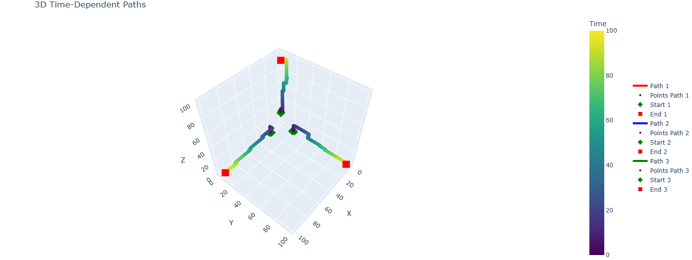

# VECROS_ROBOTICS_INTERN_ASSIGNMENT
Repository for solutions to Vecros Robotics Intern Assignment.

Submitted by: Shreyas Gupta

## Problem Statement 1: 
1. Determine shortest path between for a given set having its start and end point(user defined).
2. Plot the paths in 3D
3. In case of multiple sets ensure, that not two paths should not have a common point at any time.

### Proposed Solution:
Create a 100 × 100 × 100 grid where each point (x, y, z), has some random weight of either value between 1 and 5 or get have zero weight.

Then A* algorithm is used to determine the the shortest path between given start and end points. Here Manhattan distance is used for the Heuristic function of A*.

To get Non-Colliding Paths for multiple sets, my code will assign time schedule value to each computed path point, this prevents two paths from sharing a common point. So if a point is occupied at a given time, the algorithm delays the movement until the point is free.

The computed paths are plotted using Plotly. 
To see the user inputs and interactive visualization of paths, click [here](https://colab.research.google.com/drive/1d8IjQ2XVGszMevvb8gQCAznoyra2ww3Y?usp=sharing)

Non colliding paths determined are as:

## Problem Statement 2:
1. Make dictionary of waypoints with keys being ‘latʼ, ʼlonʼ, ‘altʼ.
2. Now using Dronekit or pymavlink, plan a mission in auto mode using these waypoints (quadcopter). Drone should land at last waypoint.
3. Print at every instance the estimated time and distance to complete the mission.
4. Plot the path of travel in 2D

